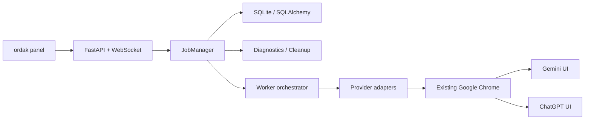

# ordak | اردک 🦆

`ordak` is a local FastAPI application that automates the real Gemini and ChatGPT web UIs through your already-open Google Chrome session on macOS. It does not call any direct LLM API.

`اردک` یک برنامه محلی FastAPI است که رابط واقعی Gemini و ChatGPT را از طریق همان Google Chrome معمولی شما که باز است کنترل می‌کند و از API مستقیم مدل استفاده نمی‌کند.

## Status

- Built for local macOS usage.
- Reuses an existing signed-in Chrome session instead of launching a separate managed browser.
- Best suited for personal workflows, local tools, and internal integrations.
- Not designed for headless cloud deployment or high-volume automation.

## What ordak does

- Reuses the real Chrome window that is already open.
- Opens or rebinds Gemini / ChatGPT tabs without launching a separate browser.
- Sends prompts like a human would inside the provider UI.
- Supports chat, image analysis, and image generation flows.
- Persists conversations, tab bindings, jobs, logs, screenshots, and extracted outputs.
- Exposes cancel / retry / resume actions.
- Lets you pin important conversations so cleanup will not remove their referenced artifacts.
- Provides a diagnostics page and storage cleanup endpoints.

## Core architecture



## Main upgrades in this version

- Provider adapter architecture for `Gemini` and `ChatGPT`
- Structured error system with recoverable actions
- Conversation persistence and tab recovery
- Cancel / retry / resume endpoints
- Robust image extraction fail-safe path
- Dedicated `/diagnostics` page and diagnostics API
- Storage retention config and cleanup API
- `ordak / اردک 🦆` branding in the app

## Project structure

```text
app/
  automation/
  providers/
  static/
  storage/
scripts/
tests/
alembic/
```

## Installation

```bash
python -m venv .venv
source .venv/bin/activate
pip install -r requirements.txt
playwright install chromium
cp .env.example .env
```

Or use the helper script:

```bash
./run.sh
```

## Required local setup

1. Keep your normal `Google Chrome` open.
2. Enable:
   `View > Developer > Allow JavaScript from Apple Events`
3. Make sure Gemini or ChatGPT already works in that same Chrome session.
4. Update `BROWSER_USER_DATA_DIR` inside `.env` for your own macOS account.
5. For ChatGPT project-scoped runs, set `CHATGPT_PROJECT_URL` in `.env`.

## Run ordak

```bash
source .venv/bin/activate
uvicorn app.main:app --reload --host 127.0.0.1 --port 8000
```

Open:

- [http://127.0.0.1:8000](http://127.0.0.1:8000)
- [http://127.0.0.1:8000/diagnostics](http://127.0.0.1:8000/diagnostics)

## Environment notes

- `.env` is local-only and should never be committed.
- `.env.example` is the public template for new setups.
- Runtime artifacts under `app/storage/` are intentionally ignored, except placeholder `.gitkeep` files.
- The default SQLite database lives at `app/storage/jobs.db`.

## Useful endpoints

- `POST /api/jobs`
- `POST /api/providers/{provider}/respond`
- `POST /api/gemini/respond`
- `POST /api/chatgpt/respond`
- `GET /api/jobs`
- `GET /api/jobs/{job_id}`
- `POST /api/jobs/{job_id}/cancel`
- `POST /api/jobs/{job_id}/retry`
- `POST /api/jobs/{job_id}/resume`
- `GET /api/conversations`
- `GET /api/conversations/{conversation_id}`
- `POST /api/conversations/{conversation_id}/pin`
- `POST /api/conversations/{conversation_id}/unpin`
- `GET /api/diagnostics`
- `GET /api/diagnostics/storage`
- `POST /api/diagnostics/cleanup`
- `POST /api/profile/open`

## Direct provider API

If you want a single HTTP call that waits for Gemini or ChatGPT and returns a final JSON payload, use these endpoints:

- `POST /api/gemini/respond`
- `POST /api/chatgpt/respond`
- `POST /api/providers/{provider}/respond`

`{provider}` can be `gemini` or `chatgpt`.

These endpoints sit on top of the same ordak job engine. They still create a job internally, but instead of returning only `job_id`, they can wait for completion and return:

- final `answer`
- `output_images` with public local URLs
- `uploads` with public local URLs
- `screenshots` with public local URLs
- `error_code`, `error_message`, `suggested_action`
- `job_api_url` and `conversation_api_url` for later polling

### Request model

JSON request body:

```json
{
  "question": "سلام Gemini خوبی؟",
  "mode": "chat",
  "conversation_id": null,
  "start_new_chat": true,
  "wait_for_completion": true,
  "wait_timeout_seconds": 300
}
```

Fields:

- `question`: required prompt text
- `mode`: `chat` | `image_analyze` | `image_generate`
- `conversation_id`: optional existing ordak conversation id
- `start_new_chat`: when `true`, ordak opens a fresh provider tab/thread
- `wait_for_completion`: when `true`, HTTP waits and returns final state; when `false`, it returns current job state immediately
- `wait_timeout_seconds`: 1 to 900 seconds

For image flows, use `multipart/form-data` and send one file field named `image`.

### Response model

Successful response shape:

```json
{
  "provider": "gemini",
  "job_id": "e6f5470e-d3e6-435d-bd2a-53a396d087f7",
  "job_api_url": "http://127.0.0.1:8000/api/jobs/e6f5470e-d3e6-435d-bd2a-53a396d087f7",
  "conversation_id": "207a89d2-d9e4-415a-ae09-79a127b175fd",
  "conversation_api_url": "http://127.0.0.1:8000/api/conversations/207a89d2-d9e4-415a-ae09-79a127b175fd",
  "conversation_title": "سلام Gemini. فقط در یک جمله کوتاه جواب بده: خوبی؟",
  "provider_conversation_url": "https://gemini.google.com/app/...",
  "mode": "chat",
  "status": "completed",
  "completed": true,
  "answer": "سلام! من عالی هستم...",
  "error_code": null,
  "error_title": null,
  "error_message": null,
  "suggested_action": null,
  "recoverable": false,
  "uploads": [],
  "output_images": [],
  "screenshots": [],
  "trace_url": null,
  "logs": []
}
```

Artifact item shape:

```json
{
  "path": "storage/outputs/example.png",
  "url": "http://127.0.0.1:8000/storage/outputs/example.png",
  "filename": "example.png"
}
```

Notes:

- `completed=true` means the job reached a terminal state, including `completed`, `failed`, `manual_verification_required`, or `cancelled`.
- For image generation, `output_images` is the main field to render.
- If extraction confidence is low, `output_images` will be empty and the response will carry a recoverable error such as `result_not_extractable`.

## How to call the API

### 1. Gemini text request with JSON

```bash
curl -X POST http://127.0.0.1:8000/api/gemini/respond \
  -H "Content-Type: application/json" \
  -d '{
    "question": "سلام Gemini. فقط کوتاه جواب بده: خوبی؟",
    "mode": "chat",
    "start_new_chat": true,
    "wait_for_completion": true,
    "wait_timeout_seconds": 180
  }'
```

### 2. ChatGPT image generate with multipart

```bash
curl -X POST http://127.0.0.1:8000/api/chatgpt/respond \
  -F 'question=پس‌زمینه را حذف کن و سفید کن.' \
  -F 'mode=image_generate' \
  -F 'start_new_chat=true' \
  -F 'wait_for_completion=true' \
  -F 'wait_timeout_seconds=300' \
  -F 'image=@sample-image-test.png'
```

### 3. Generic provider endpoint

```bash
curl -X POST http://127.0.0.1:8000/api/providers/gemini/respond \
  -H "Content-Type: application/json" \
  -d '{
    "question": "ده جمله آلمانی ساده بده.",
    "mode": "chat",
    "start_new_chat": true
  }'
```

### 4. JavaScript `fetch` example

```js
const response = await fetch("http://127.0.0.1:8000/api/gemini/respond", {
  method: "POST",
  headers: { "Content-Type": "application/json" },
  body: JSON.stringify({
    question: "سلام Gemini. یک جواب کوتاه بده.",
    mode: "chat",
    start_new_chat: true,
    wait_for_completion: true,
    wait_timeout_seconds: 180,
  }),
});

const payload = await response.json();
console.log(payload.answer);
```

### 5. JavaScript image upload example

```js
const form = new FormData();
form.append("question", "این عکس را تحلیل کن.");
form.append("mode", "image_analyze");
form.append("start_new_chat", "true");
form.append("wait_for_completion", "true");
form.append("image", fileInput.files[0]);

const response = await fetch("http://127.0.0.1:8000/api/gemini/respond", {
  method: "POST",
  body: form,
});

const payload = await response.json();
console.log(payload.answer);
console.log(payload.output_images);
```

## When to use which API

- Use `POST /api/jobs` if you want raw asynchronous job creation plus your own polling or WebSocket handling.
- Use `POST /api/gemini/respond` or `POST /api/chatgpt/respond` if you want one direct JSON response for app-to-app integration.
- Use `GET /api/jobs/{job_id}` when `wait_for_completion=false` or when you want to re-check a previous run later.

## Example prompt

```text
سلام Gemini خوبی؟
```

For image generation:

```text
پس‌زمینه این تصویر را حذف کن و سفید کن.
```

## Diagnostics

The diagnostics page shows:

- whether Chrome is running
- whether Apple Events JavaScript access works
- provider session status
- tab binding health
- last successful run by provider
- last error by provider
- active job
- queue depth
- storage usage

## Migrations

Alembic scaffolding is included:

```bash
alembic upgrade head
```

The app also keeps SQLite bootstrap/backfill logic so older local MVP databases can still open during the migration window.

## Tests

```bash
pytest -q
```

Current automated coverage includes:

- worker orchestration through provider adapters
- upload readiness verification
- job queue sequencing
- cancel / retry / resume job manager flows
- FastAPI route smoke tests

## Helper scripts

```bash
python scripts/test_gemini_flow.py --provider=gemini --mode=chat "سلام Gemini خوبی؟"
python scripts/show_diagnostics.py
python scripts/cleanup_storage.py
```

## Manual acceptance checklist

1. Open your real Chrome and confirm Gemini or ChatGPT is already logged in.
2. Open ordak in the browser.
3. Send a normal Persian chat prompt.
4. Continue the same conversation in the same provider tab.
5. Upload `sample-image-test.png` and run image analyze or image generate.
6. Check that ordak shows only trusted result images.
7. Trigger a recoverable failure, then use `Retry` or `Resume`.
8. Open `/diagnostics` and verify session and storage state.

## Known constraints

- Provider DOMs can change over time.
- Chrome must remain open.
- This project expects access to your local desktop browser session and is therefore not a typical Docker-first deployment target.
- CAPTCHA or manual verification is not bypassed.
- Image extraction is intentionally fail-safe: if confidence is low, ordak does not show an output artifact.
- `Cancel` is best-effort stop, not a hard browser reset.

## Safety note

This project does **not** implement:

- CAPTCHA bypass
- anti-bot evasion
- fingerprint spoofing
- credential automation
- proxy rotation
- mass automation
